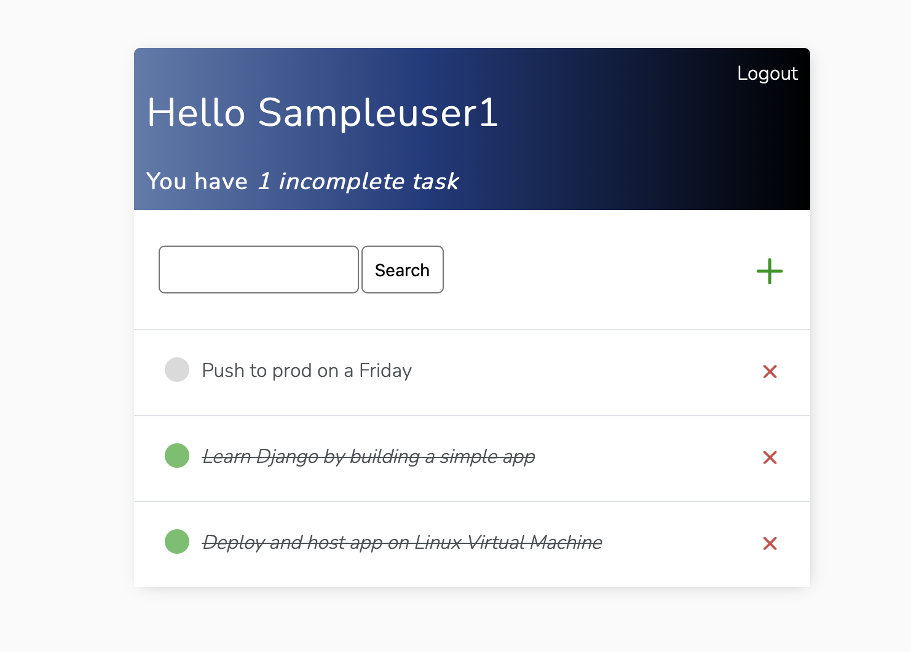

Sure, here's a README.md template for your Django project hosted on an Ubuntu Linux Virtual Machine:

```markdown
# Django Todo App

[](https://opensource.org/licenses/MIT)
[](https://www.djangoproject.com/)

A simple Todo list application built with Django, hosted on an Ubuntu Linux Virtual Machine.

Many thanks to Dennis Ivy for his wonderful [tutorial](https://www.youtube.com/watch?v=llbtoQTt4qw)!

## Features

- Create, read, update, and delete todo items.
- User authentication and authorization.
- Responsive and user-friendly interface.

## Screenshots



### Prerequisites

- Python 3.x
- Django 3.2.x
- PostgreSQL

### Usage

1. Navigate to url [`http://x.siscon1.com:81`](http://x.siscon1.com:81)

2. Login or create an account


3. Add tasks to your todo by clicking the green plus sign


Open tasks will display a grey dot


4. Click on a task, then click `Edit` to update the contents


5. Click the grey dot of a task to mark as complete


Tip: refrain from deleting tasks that are performed daily. Instead, mark them as incomplete by clicking the task's green dot. This way, there is no need to recreate daily tasks.

6. Click the red X next to a task to delete the tasks


## License

This project is licensed under the MIT License - see the [LICENSE](LICENSE) file for details.
